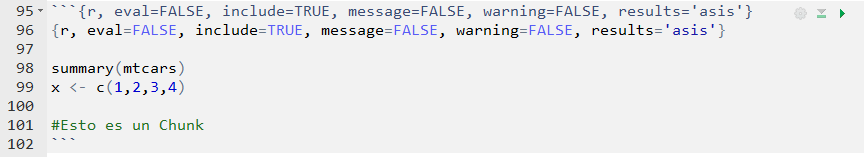

# YAML header


El YAML header corresponde al lugar donde ustedes pueden determinar las opciones de su documento. Generalmente comenzamos poniendo el nombr, autoría y fecha de su documento. Agregué otras opciones que son útiles para dar formato a su documento, tales como el tamaño de la fuentes (fontsize), el interlineado (linestretch), márgenes (geometry) y abstract.

```{r, eval=FALSE}
---
title: "Cómo usar Rmarkdown"
author: "Julio Iturra - jciturra@uc.cl"
date: '`r format(Sys.time(), "%d %B, %Y")`'  
fontsize: 11pt
linestretch: "1.0"
geometry: margin=0.78in
output:
  html_document: default
header-includes:
   - \usepackage[spanish,es-tabla,es-nodecimaldot]{babel} #Para "Tabla" y "Figura" en español. Punto para decimal.
   - \usepackage[utf8]{inputenc}
   - \usepackage{booktabs}
abstract: "El presente documento tiene por objetivo facilitarles la vida  ..."
---
```

La opción `output` tiene tres opciones para convertir su documento en `.pdf`, `.html` y `.doc`. A mi me gusta realizarlo en pdf para los informes y html para mis reportes de datos y exploración, dado que los trabajos en html pueden ser abiertos en cualquier sistema operativo sin la necesidad de un software especializado como Adove o Nitro reader (por dar algunos ejemplos).

\pagebreak

#Introducción 

Este documento está enfocado al reporte en formato .pdf, dado que me parece más adecuado para el reporte de informes y trabajos académicos. A modo general, la figura a continuación muestra cómo funciona Rmarkdown cuando estamos empleando formato .pdf.

```{r, echo=FALSE, out.width='70%', fig.align='center', fig.pos="h!"}
knitr::include_graphics(c("images/rmarkdownflow.png","images/markdown2.png"))
```

El primer cuadro es su documento en Rmarkdown, donde escriben su código en R y lo combinan con texto. [Knitr](https://yihui.name/knitr/) es el paquete que convierte todo lo que ustedes escriben a formato Markdown (.md), lo cua posteriormente es transformado por [Pandoc](https://pandoc.org/) en cualquiera de los formatos que ustedes necesiten (.pdf, .html o .doc). El resultado de este proceso es su documento final.

##Software necesario para compilar en .pdf

Cuando estamos empleando documentos en .pdf, Pandoc requiere de que ustedes tengan instalado en su computador alguno de los paquetes base para escribir documentos en \LaTeX. Para esto deben instalar alguno de los paquetes disponibles, en mi caso uso [Miktex](https://miktex.org/), el cual tiene soporte para Windows, Mac y Linux. Hasta ahora no me ha dado problemas y lo recomiendo.

1. Ir a la web de [Miktex](https://miktex.org/)
2. Descargar el instalador y ejecutarlo
3. Esperar que termine la descarga de los paquetes, lo cual puede demorar varios minutos.
4. Cuando esté todo listo, reinicien su computador.

Finalizado este paso, pueden comenza a trabajar con Rmarkdown sin problemas.

# Elaborar títulos y enumeración

`#Título grande`

`##Título mediano`

`##Título pequeño`


@ Para crear numeración con interrupciones (autonumerado)

`1.` Para crear numeración según sus necesidades

`a.` Para crear sub-numeración con letras, también se puede realizar con números.

`*` Una viñeta cuadrada

## Ecuaciones y símbolos matemáticos

`$e=mc^2$`  $e=mc^2$

`$\alpha \chi^2 \beta$` $\alpha \ \chi \ \beta$ 


Hay una hoja de consejos para usar Rmarkdwon que pueden encontrar [aquí](https://rmarkdown.rstudio.com/lesson-1.html). Aparecen muchos más detalles de lo que se señala en este documento. 

@. **Usar chunks**

    * el ctrl + alt + i

```{r, eval=FALSE, include=FALSE, message=FALSE, warning=FALSE, results='asis'}
{r, eval=FALSE, include=TRUE, message=FALSE, warning=FALSE, results='asis'}

summary(mtcars)
x <- c(1,2,3,4)

#Esto es un Chunk
```

```{r, echo=FALSE, out.width='95%', fig.align='center', fig.pos="h!"}

```


* `eval=TRUE` Sirve para determinar si queremos que se vean nuestros resultados.
* `include=TRUE` Sirve para determinar si queremos que se incluya nuestro código.
* `message=FALSE` Sirve para determinar si queremos los mensajes emergenter.
* `warning=FALSE` Sirve para determinar si queremos las advertencias de R.
* `results='asis'` Permite que el código creado por las funciones de R sea empleado en la compilación. 
* ¡run! (flecha verde o ctrl+shift+enter)

\pagebreak 

Ejemplo:

```{r, results='hold'}
#{r, results='hold'}
revolucion <- "Marx"
revolucion

velocirraptor <- "rawr"
velocirraptor
```

@. **Paquetes especializados para reporte de tablas**

    * `knitr`
    * `kableExtra` 
    * `xtable`
    * `texreg`
    * `stargazer`

Instalemos los paquetes:

```{r, eval=FALSE, message=FALSE, warning=FALSE}
install.packages("knitr")
install.packages("kableExtra")
install.packages("xtable")
install.packages("texreg")
install.packages("stargazer")
```

Carguemos los paquetes:

```{r, message=FALSE, warning=FALSE, eval=TRUE}
library(knitr)
library(kableExtra)
library(xtable)
library(texreg)
library(stargazer)
library(dplyr)    #principalmente para usar el operador %>% 
```

\pagebreak

#Ejemplo con regresión usando texreg

El paquete `texreg` es muy útil cuando se trata de reportar modelos de regresión, tiene bastantes funcionalidades, pero las principales son el hecho de que permite reportar modelos anidados en una sola tabla.

```{r, include=FALSE}
rm(list=ls())
load("coes.RData")
```

```{r modelo-logit, echo=TRUE, message=FALSE, warning=FALSE, results='asis'}
#Un logit fome...
pl <- lm(voto ~ sexo + edad + educon + ecivil + ppol+ socconf+confl, data=coes, link="logit") 
```

```{r, echo=TRUE, message=FALSE, warning=FALSE, results='asis'}

htmlreg(pl, #Si son más modelos ponemos list(m1,m2,m3)
               digits = 3, #dígitos de la tabla
               float.pos="h!", #permite dejar la tabla fija en su lugar
               scalebox = 0.70, #indica que la tabla tiene una proporción del 75% c
               caption = "Modelo Logit", #título del modelo
               custom.coef.names=c("(Intercepto)", #Podemos asignar nombres a los coeficientes
                              "Mujer","Edad","Educación",
                              "Soltero/a","Viudo/a","Sep/Div/Anu",
                              "Centro","Derecha",
                              "No sabe/No responde",
                              "Confianza Social",
                              "Per.Conflicto"),
               custom.model.names = "Modelo 1") #si son más modelos = c("Modelo1","Modelo2")

 ```

\pagebreak

## Con modelos anidados

```{r, eval=TRUE, include=TRUE, message=FALSE, warning=FALSE, results='asis'}
#```{r, eval=TRUE, include=TRUE, message=FALSE, warning=FALSE, results='asis'}
m1=glm(voto~sexo+edad+educon+ecivil+ppol+socconf,
       data=coes, family=binomial) #Educación continua
m2=glm(voto~sexo+edad+educ  +ecivil+ppol+socconf,
       data=coes, family="binomial") #Educación categórica
m3=glm(voto~sexo+edad+educon+ecivil+ppol+socconf+ppol*socconf, 
       data=coes, family="binomial") #Interacción Posición Política*Confianza Social 
texreg::htmlreg(list(m1,m2,m3), digits = 3,float.pos="h!",scalebox=0.50, 
               caption = "Modelos Logit",
               custom.model.names = c("Modelo 1", "Modelo 2", "Modelo 3"), 
               custom.coef.names = c("(Intercepto)","Mujer","Edad",
                                     "Educación","Soltero/a","Viudo/a",
                                     "Sep/Div/Anu","Centro","Derecha",
                                     "No sabe/No responde","Confianza Social",
                                     "Primaria","Secundaria","Técnica superior",
                                     "Universitaria","Centro:Conf.Social",
                                     "Derecha:Conf.Social","NS/NR:Conf.Social"))
```

## Kable y KableExtra

```{r tabla, echo=TRUE, message=FALSE, warning=FALSE, results='asis'}
#```{r tabla, echo=TRUE, message=FALSE, results='asis'} 
age = c(1,2,3,4,5)
ageF = factor(age, labels=c("35-44","45-54","55-64","65-74","75-84"))
deaths1 = c(32,104,206,186,102)
deaths2 = c(2,12,28,28,31)

#Person-Years
py1 = c(52407,43248,28612,12663,5317)
py2 = c(18790,10673,5710,2585,1462)

tabla <- as.data.frame(cbind(ageF,deaths1,py1,deaths2,py2)) #creamos el data.frame
tabla$ageF = factor(age, labels=c("35 - 44","45 - 54","55 -  64","65 - 74","75 - 84"))

#----nuestra tabla------
kable(tabla,format = "html", booktabs =TRUE, escape = FALSE, align = c("lcccc"),
      caption = "Muertes por enfermedad cardiaca después de 10 años",
      col.names = linebreak(c("Grupo de\n edad", "Muertes\n ", "Persona-años\n ",
                              "Muertes\n", "Persona-años\n"), align = "c")) %>%
  kable_styling(latex_options =c("hold_position"),full_width = FALSE) %>%
  add_header_above(c(" " = 1, "Fumadores" = 2, "No fuma" = 2))
```


```{r eval=FALSE, include=FALSE}
library(here)
rmarkdown::render(input = "tutoria-rmarkdown-html.Rmd",output_file = "index.html",encoding = "UTF-8")
```


# Algunos tutoriales que me gustan:

* [Escribir una Tesis en Rmarkdown](https://rosannavanhespenresearch.wordpress.com/2016/03/30/writing-your-thesis-with-r-markdown-5-the-thesis-layout/)(Van Espen, 2017)
* [Rmarkdown ultimate Guide](https://bookdown.org/yihui/rmarkdown/) (Xie et al. 2018)
* [KableExtra y Latex](https://haozhu233.github.io/kableExtra/awesome_table_in_pdf.pdf) (Zhu, 2018) 


